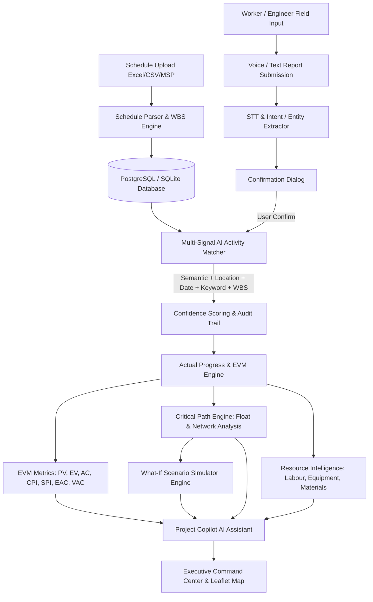
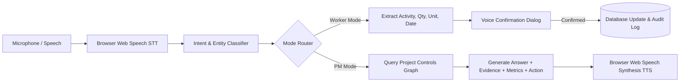

# PLAN2BUILD — AI-Powered Infrastructure Project Controls & Execution Intelligence Platform

> **Intelligent Data Capture & Schedule-Linking Layer for Infrastructure Project Management: Real-Time Actual Progress Tracking (Planning-to-Execution Bridge)**
>
> Built for **Smart India Hackathon (SIH) Problem Statement SIH26122**

---

## 🌟 Core Product Vision

**"Don't just track construction progress. Connect reality to the plan, explain what is happening, predict what happens next, and help people take action."**

Plan2Build transforms traditional construction progress dashboards into an integrated **AI-Powered Project Controls Platform** connecting:

$$\text{PROJECT PLAN} \longrightarrow \text{SCHEDULE} \longrightarrow \text{SITE EXECUTION} \longrightarrow \text{REAL-TIME DATA} \longrightarrow \text{AI UNDERSTANDING} \longrightarrow \text{PROGRESS} \longrightarrow \text{COST (EVM)} \longrightarrow \text{RISK} \longrightarrow \text{PREDICTION} \longrightarrow \text{VOICE ASSISTANCE} \longrightarrow \text{DECISION SUPPORT}$$

---

## 📐 System Architecture & Data Flow



---

## 🎙️ Voice Architecture



---

## 🎯 Complete Feature Matrix

### 1. Cost Intelligence & EVM (Earned Value Management)
- Tracks **Budgeted Cost**, **Unit Rate**, **Planned Quantity**, **Actual Quantity**, **Planned Cost**, **Actual Cost**, and **Cost Variance**.
- Full **BOQ Support**: Item Code, Unit, Budgeted Cost, Actual Spent, Progress %.
- EVM Metrics:
  - **PV (Planned Value)**: Budgeted cost of scheduled work.
  - **EV (Earned Value)**: Budgeted cost of performed work.
  - **AC (Actual Cost)**: Actual cost spent to date.
  - **CPI (Cost Performance Index)**: $EV / AC$ (> 1.0 is under budget).
  - **SPI (Schedule Performance Index)**: $EV / PV$ (> 1.0 is ahead of schedule).
  - **EAC (Estimated Cost at Completion)**: $BAC / CPI$.
  - **VAC (Variance at Completion)**: $BAC - EAC$.

### 2. What-If Scenario Simulator Engine (`/scenarios`)
- Test scenarios interactively:
  - Manpower Adjustment (+/- N workers)
  - Shift & Overtime Hours (+/- N hrs/day)
  - Material Delivery Delays (N days)
  - Productivity Multipliers (0.8x to 1.5x)
- Returns **BASELINE vs SCENARIO** forecast comparison (Completion date pull-in, Net schedule days saved, Cost impact in INR, Affected critical path activities).

### 3. Critical Path Intelligence (`/critical-path`)
- Computes Forward Pass (ES, EF) and Backward Pass (LS, LF).
- Calculates **Total Float (Slack)** = $LS - ES$.
- Identifies **Zero-Float Critical Path Chain**.
- **Interactive Downstream Impact Calculator**: Simulates downstream propagation when an activity delay occurs.
- Differentiates "Activity is delayed" from "Activity is delayed AND threatens project completion".

### 4. AI Project Manager / Copilot (`/copilot`)
- Conversational assistant answering questions using **REAL ground-truth project data**.
- Guaranteed zero hallucinations.
- Returns structured responses: **ANSWER + EVIDENCE + RELEVANT METRICS + RECOMMENDED ACTION**.

### 5. Multilingual Voice Assistant (`/worker-mode` & `/copilot`)
- Supports **English**, **Telugu (తెలుగు)**, and **Hindi (हिन्दी)**.
- **Mode A (Worker)**: Converts spoken reports into structured progress updates with confirmation dialogs before DB mutation.
- **Mode B (Project Manager)**: Answers queries and triggers permission-controlled voice actions.

### 6. Resource Intelligence (`/resources`)
- **Labour Productivity**: Actual vs Planned Units/Man-Hour, Trade breakdown.
- **Equipment Utilization**: Available, Operating, and Idle hours with utilization % fleet table.
- **Material Intelligence**: Planned vs Consumed quantities, overconsumption risk, and waste detection.

### 7. Offline-First Site Reporting
- Saves site updates in `localStorage` offline queue when network drops.
- Displays "X Reports Pending Sync" badge with **Sync Now** trigger.

### 8. Automated Photo Timeline & Computer Vision Evidence (`/evidence`)
- Visual progression timeline (Before, During, Latest) with side-by-side comparison.
- OpenCV / YOLO detection tags ("AI Visual Evidence", object counts, confidence score badge, human verification toggle).

### 9. Automated Daily Progress Report (DPR) (`/dpr`)
- Aggregates daily progress, EVM metrics, completed site reports, delays, manpower, equipment, materials, and recommended actions into a printable/PDF format.

### 10. Auditability & Traceability Center (`/audit`)
- Immutable trace log for activity matching, progress edits, and voice actions with confidence indicators (High / Medium / Low).

### 11. Execution Intelligence (`/execution`)
- Additive plan-to-actual workflow for `START`, `FINISH`, `PROGRESS`, `HOLD`, and `RESUME` events with discipline inference and planner correction.
- Supports pasted reports plus CSV, XLS, XLSX and TXT ingestion. PDF/JPG/JPEG/PNG diaries retain file/page metadata; without configured OCR they are explicitly queued for manual review and no extraction is fabricated.
- Approved actual dates are versioned and audited, while idempotent local schedule-sync queue records preserve the existing demo database. Primavera P6 and MS Project adapters are labelled stubs only: no live PMIS connection is claimed without separately configured credentials.
- Open the Execution Intelligence page, paste a synthetic daily report, review an event, and inspect confirmed actual-vs-planned duration. Inferred values are labelled for planner review.

---

## ⏱️ 5-Minute SIH Demo Flow

1. **Step 1 — Command Center**: Open `http://localhost:3000`. Point out SPI (0.95), CPI (1.02), Earned Value (₹45.78 Cr), and 4 Critical Path activities.
2. **Step 2 — Schedule & WBS**: Open Schedule to view 13 WBS activities and dependency chains.
3. **Step 3 — Worker Voice Update**: Click **Worker / Site Mode** (`/worker-mode`). Click microphone and say:
   > *"Today we completed 120 square meters of foundation reinforcement in Block B."*
4. **Step 4 — AI Entity Extraction & Match**: System shows extracted entities (Quantity: 120, Unit: m², Activity: Foundation Reinforcement – Block B, Match Confidence: 92%).
5. **Step 5 — Confirm**: Click **Confirm**. Progress and EVM metrics update instantly.
6. **Step 6 — Ask Copilot**: Open `/copilot`. Click microphone or type:
   > *"Which activities threaten the final completion date?"*
   Copilot returns answer with ground-truth evidence and recommended actions.
7. **Step 7 — Run Scenario**: Open `/scenarios`. Adjust manpower (+8 workers) and click **Execute What-If Simulation**. Show completion date pull-in from Nov 30 to Nov 25.
8. **Step 8 — Offline Demo**: Disconnect network, submit report (saved as Pending Sync), reconnect network and click **Sync Now**.
9. **Step 9 — Generate DPR**: Open `/dpr` to preview and print the Daily Progress Report.

---

## 💻 Setup & Execution Commands

### Option 1: Run via Docker Compose

```bash
docker compose up --build
```

- **Frontend URL:** `http://localhost:3000`
- **Backend API Docs:** `http://localhost:8000/docs`

---

### Option 2: Run Locally (Development Mode)

#### 1. Backend Setup

```bash
cd backend
python -m venv venv
venv\Scripts\activate      # Windows
pip install -r requirements.txt
python run_tests.py        # Run validation suite (10/10 tests)
uvicorn app.main:app --reload --port 8000
```

#### 2. Frontend Setup

```bash
cd frontend
npm install
npm run dev
```

---

## 🧪 Testing Verification

Run the comprehensive backend validation suite:

```bash
cd backend
python run_tests.py
```

Expected Output:
```
=== Running SIH26122 Backend Validation Tests ===
[1/5] Testing Schedule Column Normalization... [PASS]
[2/5] Testing Planned & Actual Progress Engine... [PASS]
[3/5] Testing AI Matcher Subscores... [PASS]
[4/5] Testing Full Multi-Signal AI Activity Matcher... [PASS]
[5/5] Testing Productivity-Based Delay Forecaster... [PASS]
[6/10] Testing EVM Cost & Earned Value Engine... [PASS]
[7/10] Testing Critical Path Network Analysis... [PASS]
[8/10] Testing What-If Scenario Simulator... [PASS]
[9/10] Testing Labour & Equipment Resource Engine... [PASS]
[10/10] Testing Project Copilot & Voice Processing... [PASS]

ALL 10 BACKEND TEST SUITES PASSED SUCCESSFULLY!
```

---

## 📜 API Documentation Summary

- `GET /api/projects/{id}/evm` — EVM metrics (BAC, PV, EV, AC, CPI, SPI, EAC, VAC).
- `GET /api/projects/{id}/boq` — BOQ items breakdown and progress %.
- `GET /api/projects/{id}/critical-path` — Critical path zero-float chain & network nodes.
- `POST /api/activities/{id}/downstream-impact` — Calculate downstream delay impact.
- `POST /api/scenarios/run` — Run what-if scenario simulation.
- `POST /api/copilot/query` — AI Project Copilot query engine.
- `POST /api/voice/process` — Process voice transcript to intent/entities.
- `POST /api/voice/confirm` — Confirm and execute voice action.
- `GET /api/projects/{id}/labour` — Labour productivity variance %.
- `GET /api/projects/{id}/equipment` — Equipment fleet utilization %.
- `GET /api/projects/{id}/materials` — Material consumption risk.
- `POST /api/dpr/generate` — Generate Daily Progress Report.
- `GET /api/audit-logs` — Audit trail logs.
- `POST /api/sync` — Synchronize offline report queue.
