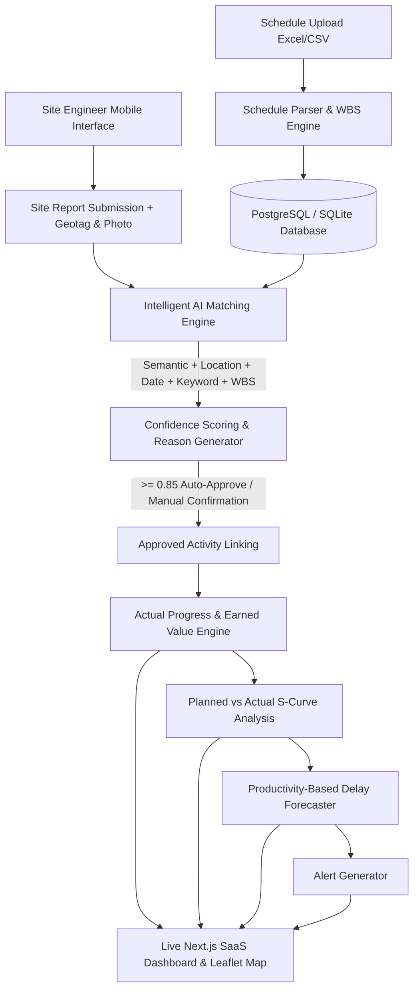

# Implementation Plan - SIH26122: Intelligent Data Capture & Schedule-Linking Layer

This document outlines the architecture, database schema, AI matching algorithms, progress engines, API specifications, and full-stack implementation plan for the **Smart India Hackathon SIH26122** platform: **"Intelligent Data Capture & Schedule-Linking Layer for Infrastructure Project Management (Planning-to-Execution Bridge)"**.

---

## User Review Required

> [!IMPORTANT]
> **Key Architecture Decisions:**
> 1. **Standalone & Zero-External-Dependency Default:** The AI activity matcher utilizes local embedding models (`sentence-transformers/all-MiniLM-L6-v2`) with a robust TF-IDF / fuzzy cosine similarity fallback so it works 100% offline out-of-the-box without requiring OpenAI or paid API keys. An optional LLM wrapper will be included for extended context generation when an API key is present.
> 2. **Database Compatibility:** SQLAlchemy + PostgreSQL (via Docker Compose) with automated SQLite fallback for immediate zero-config local execution during initial frontend/backend testing.
> 3. **Interactive S-Curve & S-Curve Real-Time Updates:** S-Curve analytics and Earned Value Management (EVM) metrics (Planned Progress %, Actual Progress %, Schedule Variance, Earned Progress) are recalculated dynamically on every site report match.
> 4. **1-Click Demo Mode:** A live interactive simulation button ("Run Demo Update") will instantly inject realistic field site reports, match them via AI, update progress S-curves, and generate color-coded alerts in real-time.

---

## Proposed Technical Architecture

---

## Proposed Changes

### Backend (`/backend`)

Python 3.11+ / FastAPI / SQLAlchemy / Pydantic / Pytest / OpenCV / Sentence-Transformers

#### [NEW] [backend/app/main.py](file:///d:/Plan2Build/backend/app/main.py)
FastAPI application entrypoint with CORS middleware, static mount for uploaded evidence photos, API routers, and database startup event handlers.

#### [NEW] [backend/app/core/config.py](file:///d:/Plan2Build/backend/app/core/config.py)
App configuration handling environment variables (`DATABASE_URL`, `UPLOAD_DIR`, `EMBEDDING_MODEL`, `LLM_API_KEY`, etc.).

#### [NEW] [backend/app/core/database.py](file:///d:/Plan2Build/backend/app/core/database.py)
SQLAlchemy session, engine configuration, and DB table creation utilities.

#### [NEW] [backend/app/models/schema.py](file:///d:/Plan2Build/backend/app/models/schema.py)
SQLAlchemy models implementing all 9 required relational entities:
- `Project`
- `ScheduleActivity`
- `ActivityDependency`
- `SiteReport`
- `EvidencePhoto`
- `ActivityMatch`
- `ProgressRecord`
- `Alert`
- `User`

#### [NEW] [backend/app/schemas/pydantic_models.py](file:///d:/Plan2Build/backend/app/schemas/pydantic_models.py)
Pydantic schemas for request/response validation (Projects, Schedules, Site Reports, AI Matches, Progress, Alerts, Analytics, Seed data).

#### [NEW] [backend/app/services/schedule_parser.py](file:///d:/Plan2Build/backend/app/services/schedule_parser.py)
Robust CSV/XLSX parser with fuzzy column mapping (`Activity ID`, `Activity Name`, `WBS`, `Start Date`, `End Date`, `Planned Quantity`, `Unit`, `Location`, `Predecessors`), data cleaning, validation, preview generator, and database bulk insertion.

#### [NEW] [backend/app/ai/matcher.py](file:///d:/Plan2Build/backend/app/ai/matcher.py)
The **Hybrid AI Activity Matcher**:
- Weighted formula: `0.35 * Semantic + 0.25 * Location + 0.20 * Date + 0.10 * Keyword + 0.10 * WBS`
- Local vector embedding similarity (SentenceTransformers `all-MiniLM-L6-v2` with TF-IDF fallback)
- Spatial distance/location string matching
- Date compatibility window verification
- Rule-based explainability text generator ("Why this activity was matched")
- Confidence thresholding: `>=0.85` (Auto-Approved), `0.65–0.84` (Needs Confirmation), `<0.65` (Low Confidence).

#### [NEW] [backend/app/services/progress_engine.py](file:///d:/Plan2Build/backend/app/services/progress_engine.py)
Progress calculation service:
- Date-based Planned Progress % calculation: `(CurrentDate - StartDate) / (EndDate - StartDate) * 100`
- Actual Quantity Progress % calculation: `(ActualQty / PlannedQty) * 100`
- Variance %: `Actual % - Planned %`
- Status classifier: `ON TRACK` (Variance >= 0), `AT RISK` (-10% <= Variance < 0), `DELAYED` (Variance < -10%)
- Aggregated WBS & Project level S-Curve calculations and Earned Progress.

#### [NEW] [backend/app/services/forecast_engine.py](file:///d:/Plan2Build/backend/app/services/forecast_engine.py)
Delay prediction service based on empirical productivity:
- `actual_daily_productivity = total_actual_qty / elapsed_days`
- `remaining_qty = planned_qty - actual_qty`
- `remaining_days = remaining_qty / actual_daily_productivity`
- Projected Completion Date & Expected Delay (Days)
- Productivity deficit analysis (Required vs Actual daily rate).

#### [NEW] [backend/app/services/alert_engine.py](file:///d:/Plan2Build/backend/app/services/alert_engine.py)
Rule-based alert generator for:
- Delayed Activities (RED)
- At-Risk Activities (YELLOW)
- Low Productivity Trends (YELLOW)
- Missing Field Updates (>3 Days) (BLUE)
- Forecasted Overruns (RED)

#### [NEW] [backend/app/services/cv_module.py](file:///d:/Plan2Build/backend/app/services/cv_module.py)
OpenCV / Image Analysis service:
- Image validation, timestamp/exif extraction, metadata scanning.
- Construction equipment/rebar/concrete visual quality feature detector abstraction.

#### [NEW] [backend/app/services/seed_service.py](file:///d:/Plan2Build/backend/app/services/seed_service.py)
Initial seed data script populating "Smart City Flyover - Package A" infrastructure project with 15 WBS activities, 20+ historical site reports, evidence photos, alerts, and progress history.

#### [NEW] [backend/app/api/endpoints/...](file:///d:/Plan2Build/backend/app/api/)
FastAPI routers for:
- `/api/projects`: CRUD for projects & dashboard summary
- `/api/schedules`: Upload, preview, download sample Excel/CSV
- `/api/site-reports`: Create report, list reports, approve/override AI match
- `/api/progress`: S-curve analytics, EVM metrics, WBS breakdown
- `/api/alerts`: List alerts, mark read
- `/api/demo`: Execute 1-click interactive demo updates

---

### Frontend (`/frontend`)

Next.js 14 / TypeScript / Tailwind CSS / Recharts / Leaflet Maps / Lucide Icons

#### [NEW] [frontend/src/app/layout.tsx](file:///d:/Plan2Build/frontend/src/app/layout.tsx) & [globals.css](file:///d:/Plan2Build/frontend/src/app/globals.css)
Root layout with sidebar navigation, top header, Toast notifications, dark/light theme accents, and custom glassmorphism styles.

#### [NEW] [frontend/src/components/layout/Sidebar.tsx](file:///d:/Plan2Build/frontend/src/components/layout/Sidebar.tsx) & [Header.tsx](file:///d:/Plan2Build/frontend/src/components/layout/Header.tsx)
Responsive sidebar containing main navigation (Dashboard, Projects, Schedule, Site Reports, Activities, Map, Alerts, Analytics, Settings) and quick demo trigger.

#### [NEW] [frontend/src/app/page.tsx](file:///d:/Plan2Build/frontend/src/app/page.tsx)
Executive Dashboard:
- KPI Summary Cards (Total Projects, Overall Planned %, Overall Actual %, Variance %, Delayed Activities, Forecasted Delay)
- Interactive Planned vs Actual S-Curve Chart (Recharts Area/Line chart)
- WBS Progress Distribution & Activity Status breakdown
- Delay Risk Matrix
- Live Alert feed
- Recent Site Reports stream

#### [NEW] [frontend/src/app/projects/[id]/page.tsx](file:///d:/Plan2Build/frontend/src/app/projects/[id]/page.tsx)
Detailed Project Management View with tabbed sub-views (Overview, Schedule, Activities, Site Reports, Progress, Map, Alerts, Analytics).

#### [NEW] [frontend/src/app/schedule/page.tsx](file:///d:/Plan2Build/frontend/src/app/schedule/page.tsx)
Schedule Management Page:
- CSV/XLSX Upload Drag & Drop Wizard
- Data validation preview with row error highlighting
- Interactive WBS hierarchy tree & download sample file link.

#### [NEW] [frontend/src/app/site-reports/new/page.tsx](file:///d:/Plan2Build/frontend/src/app/site-reports/new/page.tsx)
Mobile-optimized Site Engineer Data Capture Form:
- Activity report description, quantity, unit, remarks
- GPS Geolocation integration with auto-browser coordinate capture
- Photos upload with instant preview
- Labour count, equipment used, material consumption inputs
- Real-time post-submission **AI Activity Matcher Modal** showing top 3 candidate activities, confidence score badges, and detailed matching rationale breakdown with manual override support!

#### [NEW] [frontend/src/app/map/page.tsx](file:///d:/Plan2Build/frontend/src/app/map/page.tsx)
Interactive OpenStreetMap / Leaflet View displaying project site boundary, activity zones, and geotagged site reports with status pins (Green = On Track, Yellow = At Risk, Red = Delayed).

#### [NEW] [frontend/src/app/activities/[id]/page.tsx](file:///d:/Plan2Build/frontend/src/app/activities/[id]/page.tsx)
Deep-dive Activity Detail view showing planned vs actual progress, daily productivity metrics, delay forecasts, dependencies timeline, linked site reports, evidence photo gallery, and AI match logs.

#### [NEW] [frontend/src/components/demo/DemoTrigger.tsx](file:///d:/Plan2Build/frontend/src/components/demo/DemoTrigger.tsx)
"Run Demo Update" button triggering automatic backend execution of live field updates to demonstrate real-time graph recalculations and alerts during hackathon presentation.

---

### Data & Docker (`/data`, `/docker`, `docker-compose.yml`)

#### [NEW] [data/demo_schedule.csv](file:///d:/Plan2Build/data/demo_schedule.csv) & [data/demo_schedule.xlsx](file:///d:/Plan2Build/data/demo_schedule.xlsx)
Realistic infrastructure schedule file for "Smart City Flyover – Package A" with WBS codes, dates, quantities, units, and dependencies ready for user download/import testing.

#### [NEW] [docker-compose.yml](file:///d:/Plan2Build/docker-compose.yml) & [Dockerfile](file:///d:/Plan2Build/docker-compose.yml)
Complete multi-container setup for Frontend (Node/Next.js), Backend (FastAPI), and Database (PostgreSQL).

---

## Verification Plan

### Automated Tests
1. **Backend Test Suite (`/backend/tests`):**
   - Run `pytest` covering:
     - Schedule CSV/XLSX parser validation & column mapping.
     - Hybrid AI matcher vector embeddings & scoring weights.
     - Progress Engine planned % calculation, variance %, and status tagging.
     - Productivity-based delay forecast algorithm.
     - Alert engine trigger logic.

### Manual & Interactive Verification
1. **1-Click Demo S-Curve S-curve Test:** Verify clicking "Run Demo Update" immediately creates a new site report, executes AI matching, updates progress metrics, and triggers alerts.
2. **Schedule Importer Test:** Upload `demo_schedule.csv` via the UI, verify mapping validation, preview, and insertion into the database.
3. **Site Engineer Mobile Submission Test:** Submit a new field update with photo and location, verify AI top match candidate with confidence score breakdown, and approve the match.
4. **Interactive Map Test:** Verify geotagged site report pins and activity markers render correctly on Leaflet maps.
